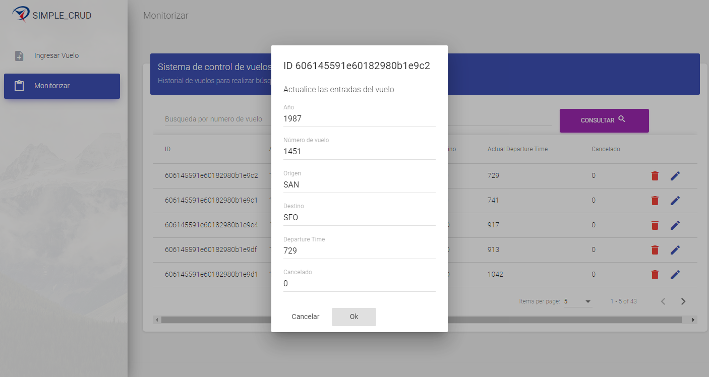

<h1 align="center">SIMPLE MONGO CRUD</h1>
<p align="center"><i>A simple mongodb CRUD application developed in NodeJs with material-angular</i></p>
<div align="center">
  <a href="https://github.com/TheWorstOne/SimpleMongoCRUD/stargazers"></a>
<a href="https://github.com/TheWorstOne/SimpleMongoCRUD/network/members"></a>
<a href="https://github.com/TheWorstOne/SimpleMongoCRUD/pulls"></a>
<a href="https://github.com/TheWorstOne/SimpleMongoCRUD/issues"></a>
<a href="https://github.com/TheWorstOne/SimpleMongoCRUD/graphs/contributors"></a>
<a href="https://github.com/TheWorstOne/SimpleMongoCRUD/blob/master/LICENSE"></a>
</div>
<br>
<p align="center"><i>Interested in the project? Please visit my <a target="_blank" href="https://mangelladev.web.app/">website</a></i></p>
<br>

<!-- ABOUT THE PROJECT -->
This repository was created as part of a Big Data project in which services must be consumed from a database made in MondoDB with the historical information of the `flights of US airlines`. This project was designed to work as a front-end for the [Netlify Serverless](https://github.com/TheWorstOne/netlify-serverless) repo. Check the [Demo](https://simplemongo-crud.web.app/flight-history)!

<p align="center">
  <a href="#">
    
  </a>
</p>
<br>

If you like this Repo, Please click the :star:

<!-- TABLE OF CONTENTS -->
## **Contents**
  - [Getting Started](#getting-started)
  - [Usage](#usage)
  - [License](#license)
  - [Contact](#contact)
  - [Acknowledgements](#acknowledgements)

  <!-- GETTING STARTED -->
## **Getting Started**

This is an example of how you may give instructions on setting up your project locally.
To get a local copy up and running follow these simple example steps.

### **Prerequisites**

List of things you need to use this project.
* [Netlify Serverless Backend](https://github.com/TheWorstOne/netlify-serverless) or any backend you have to publish your services
* A Database to query your data (_we use MongoDB, you can use anything_)

### **Installation**

1. Clone the repo
   ```sh
   git clone https://github.com/TheWorstOne/SimpleMongoCRUD.git
   ```
2. Install NPM packages
   ```sh
   npm install
   ```

<!-- USAGE EXAMPLES -->
## **Usage**

To use this project in your local environment, follow the steps below.

1. First of all you must configure the endpoint URL in the `src\app\rest.service.ts` file
   ```JS
    const endpoint = 'https://airlines-backend.netlify.app/.netlify/functions/app/flights/';
   ```
    That's all. You can put any URL you want here.

2. To test the project in local run these commands
    ```sh
    ng serve
    npm start
   ```


<!-- LICENSE -->
## **License**

Distributed under the MIT License. See `LICENSE` for more information.

<!-- CONTACT -->
## **Contact**

Miguel Ángel Macías - 👨‍💻[Linkedin](https://www.linkedin.com/in/mangelladev/)

My Personal Website: ✨[mangelladev.com](https://mangelladev.web.app/)

<!-- ACKNOWLEDGEMENTS-->
## **Acknowledgements**
* [David Santos]()
* [Kevin Maxi](https://github.com/KevinMaxi98)